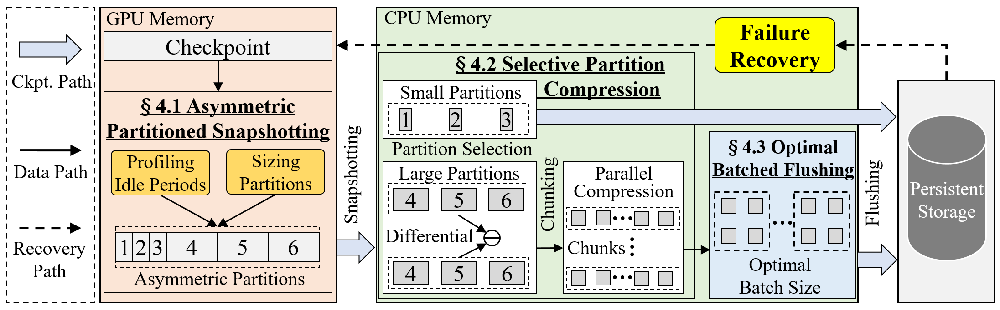

# AsymCheck: Asymmetric Partitioned Checkpointing for Efficient Large Language Model Training

**AsymCheck** is an asymmetric partitioned checkpointing mechanism that adjusts partition sizes for efficient LLM training, using smaller partitions for forward passes and larger partitions for backward passes.
Further, **AsymCheck** incorporates two key techniques: (i) a selective partition compression scheme to reduce checkpoint size with low compression overhead and (ii) a batched flushing mechanism to minimize persistence latency.

# Introduction
This code repository covers:

### __SAFusion Framework__
- AsymCheck(Naive): Asymmetric Partitioned Snapshotting
- AsymCheck-S: Selective Partition Compression
- AsymCheck-(S+O): Optimal Batched Flushing

### __State-of-the-art tensor fusion schemes__

- [PCcheck](https://github.com/eth-easl/pccheck)
- [DataStates-LLM](https://github.com/DataStates/datastates-llm)
- [Gemini](https://github.com/DAC26-AsymCheck/AsymCheck/tree/main/gemini)
- [CheckFreq](https://github.com/msr-fiddle/CheckFreq)
- [EXcp](https://github.com/Gaffey/ExCP)


# Implementation


**AsymCheck** employs a decoupled and hierarchical storage design for checkpointing and consists of four modules:

1. An asymmetric partitioned snapshotting module
2. A selective partition compression module
3. An optimal batched flushing module
4. A failure recovery module

## **__AsymCheck__** System Architecture

The system architecture of **AsymCheck** is as follows: 

<center class ='img'>

</center>


# Installation

## **Prerequisites**
- Python >= 3.12
- PyTorch-1.3.+
- CUDA-12.6
- DeepSpeed-0.14.5 
- NCCL-2.20.5 
- Hadoop-3.3.6
- Huggingface-0.24.6


## **Get the code**
``` shell
git clone https://github.com/DAC26-AsymCheck/AsymCheck
cd AsymCheck
pip install -r requirements.txt
python setup.py
```
If pip installation fails, please try to upgrade pip via `pip install --upgrade pip`. If [DeepSpeed](https://github.com/deepspeedai/DeepSpeed) installation with NCCL failed, please check the installation [guide](https://www.deepspeed.ai/).


## **Quick start**
We provide codes for seven types of checkpointing solutions. They are ExCP, DataStates-LLM, PCcheck, Gemini, CheckFreq, and AsymCheck. For each method, there are codes for six models, which are GPT2, BERT, RoBERT, BLOOM, ResNet, and ViT.

For example, to run GPT2 10B, BERT 10B, RoBERT 10B, BLOOM 10B with AsymCheck:

**To run GPT2 10B, BERT 10B, RoBERT 10B, BLOOM 10B training job:**
``` shell
cd AsymCheck/example/llm/gpt2
bash run_clm_no_trainer_ds_gpt2_layer_10B_asym.sh
```

**To run BERT 10B training job:**
``` shell
cd AsymCheck/example/llm/bert
bash run_squad_ds_z3_bert_10B_asym.sh
```

**To run Roberta 10B training job:**
``` shell
cd AsymCheck/example/llm/roberta
bash run_mlm_no_trainer_roberta_ds_asym.sh
```

**To run Bloom 10B training job:**
``` shell
cd AsymCheck/example/llm/bloom
bash run_clm_no_trainer_bloom_ds_asym.sh
```


## **Papers**

AsymCheck: Asymmetric Partitioned Checkpointing for Efficient Large Language Model Training

If you are using this repository for your paper, please cite our work
```
@inproceedings{ming2026SSFusion,
  title={AsymCheck: Asymmetric Partitioned Checkpointing for Efficient Large Language Model Training},
  author={Zhangqiang Ming and Yuchong Hu and Zhiyuan Luo and Patrick P.C. Lee and Yuanhao Shu and Wenxiang Zhou and Xinjue Zheng and Dan Feng},
  booktitle={Proceedings of the 63dr Design Automation Conference (DAC2026)},
  url={https://doi.org/10.1145/xxxx.xxxx}
  year={2026}
}
```


## **Referred Datasets**

- Wikitex-103/2: [https://huggingface.co/datasets/wikitext](https://huggingface.co/datasets/wikitext)
- SQuAD: [https://rajpurkar.github.io/SQuAD-explorer/](https://rajpurkar.github.io/SQuAD-explorer/)
- ImageNet: [https://www.image-net.org/](https://www.image-net.org/)


